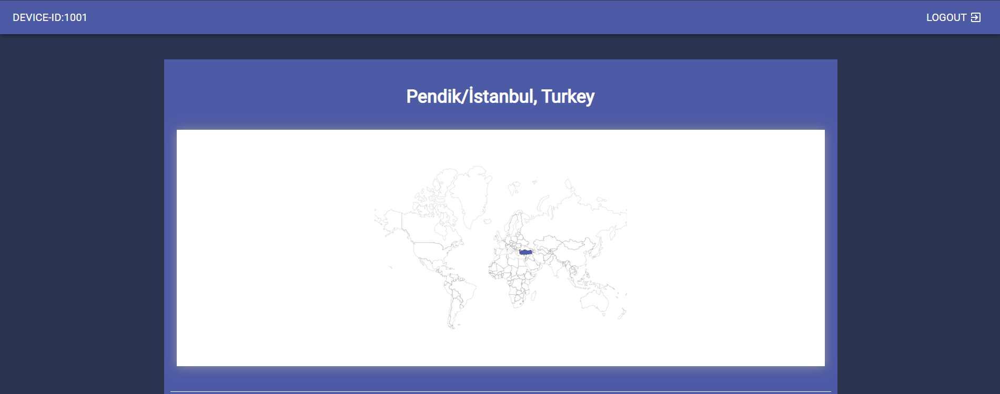

# Temperature/Humidity Bot

I developed it with the following technologies

Node.js                              |  AWS Lambda                             | React.js                             | Arduino                                 | Firebase 
:-----------------------------------:|:---------------------------------------:|:------------------------------------:|:---------------------------------------:|:-------------------------
  ||  | | 

## What is it?

It's an IOT application that lets you measure temperature and humidity of your device's environment and it finds your device's location. 

There is a frontend application for monitoring and sharing the data via e-mail and twitter(limited with my account).
Also there is a backend service for fetching sensor data from database, tweeting, sending an e-mail and for user operations.

## How it works? 

### ESP8266

 

 

There is a DHT 11 (for measuring temperature and humidity) sensor connected to NodeMCU LoLin ESP8266. Development kit has a WiFi module so it can have internet connection. 

Using Google's Geolocation API for finding connected router's latitude and longitude.
Around every 30 seconds sending sensor and location data to Firebase.  

      

 

### Backend

 

Backend service interacts with database and frontend application. I used Node.js, AWS Lambda and Serverless Framework.  

Purpose of endpoints :

- Creating a new user 
- Authentication for login
- Returning sensor data
- Returning location data (It's returning city and district not latitude and longitude. To find exact location using Google's Geocoding API)
- Sending e-mail (Using nodemailer)
- Tweeting (Using Twitter API)

### Frontend

Used React.js, Material-UI, Recharts, react-svg-worldmap and react-circularprogressbar. Deployed to Heroku.

 

  

### Architecture Diagram

 

